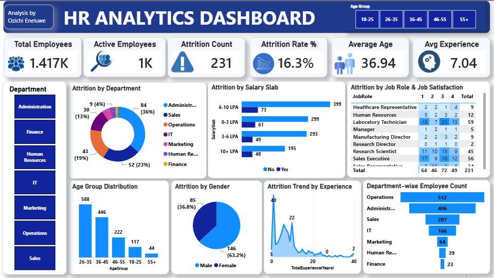

# HR Analysis Dashboard


## Project Overview

This project focuses on analyzing employee data to understand workforce composition, employee attrition, job satisfaction, salary distribution, and employee experience.

Using Microsoft Power BI, I transformed HR data into an interactive dashboard that provides a clear view of key workforce metrics and allows users to explore employee patterns across different departments.

The dashboard is designed to support data-driven HR decision-making by making workforce trends and employee-related metrics easier to understand and analyze.

## Project Objective

The primary objective of this project was to analyze employee data and develop an interactive HR dashboard that answers important workforce-related questions.

### Key questions explored:

- What is the total number of employees?
- How many employees are currently active?
- What is the employee attrition count and attrition rate?
- How is the workforce distributed across departments?
- Which job roles have higher employee representation and attrition?
- How is employee attrition distributed across salary slabs?
- How does job satisfaction vary across employees?
- What does the workforce age distribution look like?
- How is the workforce distributed by gender?
- How does employee experience vary across the workforce?

---

## Key Performance Indicators

The dashboard tracks the following KPIs:

| KPI | Description |
|---|---|
| **Total Employees** | Overall number of employees in the dataset |
| **Active Employees** | Employees who remain active in the organization |
| **Attrition Count** | Number of employees who have left the organization |
| **Attrition Rate** | Percentage of employees who have left |
| **Average Age** | Average age of employees |
| **Average Experience** | Average years of employee experience |

---

## Dashboard Analysis

### Workforce Analysis

The dashboard provides an overview of the organization's workforce using:

- Employee count by department
- Employee distribution by gender
- Employee distribution by age group
- Employee experience trends
- Job role distribution

### Attrition Analysis

Employee attrition was analyzed across multiple dimensions, including:

- Department
- Salary slab
- Job role
- Job satisfaction

This allows users to explore where employee turnover is concentrated and investigate potential workforce patterns.

### Salary Analysis

Employees were analyzed across different salary slabs to understand the distribution of the workforce across compensation levels and examine how salary categories relate to attrition.

### Job Satisfaction Analysis

Job satisfaction was analyzed alongside employee attrition to provide a better understanding of workforce retention patterns.

### Experience Analysis

Employee experience was examined to understand the composition of the workforce across different levels of professional experience.

---

## Interactive Features

The dashboard includes interactive filtering that allows users to:

- Filter the analysis by **department**
- Explore workforce metrics dynamically
- Compare employee patterns across different categories
- Drill into specific areas of the workforce

---

## Tools & Technologies

- **Microsoft Power BI** — Data visualization and dashboard development
- **Power Query** — Data cleaning and transformation
- **Microsoft Excel / CSV** — Dataset and data preparation

---

## Data Analysis Process

The project followed a structured data analytics workflow:

**Raw Data → Data Cleaning → Data Transformation → Analysis → KPI Development → Visualization → Insights**

### 1. Data Preparation
Reviewed and prepared the HR dataset for analysis.

### 2. Data Cleaning & Transformation
Used Power Query to prepare the data for visualization and analysis.

### 3. Data Analysis
Analyzed employee demographics, attrition, salary, job satisfaction, job roles, departments, and experience.

### 4. KPI Development
Created key workforce metrics to provide a high-level overview of employee performance and retention.

### 5. Dashboard Development
Designed an interactive Power BI dashboard that presents the analysis in an easy-to-understand format.

---

## Business Value

HR analytics can help organizations move from simply tracking employee numbers to understanding workforce patterns.

This dashboard can support HR teams and decision-makers in:

- Monitoring employee attrition
- Understanding workforce composition
- Identifying departments requiring further investigation
- Examining salary distribution
- Monitoring employee satisfaction
- Understanding workforce experience
- Supporting data-driven workforce planning

---

## Skills Demonstrated

- Data Cleaning
- Data Transformation
- Data Analysis
- Data Visualization
- KPI Development
- Dashboard Development
- Power BI
- Power Query
- HR Analytics
- Business Intelligence
- Data Storytelling
- Interactive Reporting

---

## Project Contents
```text
hr_analysis_Dashboard/
│
├── README.md
├── HR_Analytics_Dashboard.pbix
├── HR_Analytics_Dashboard.png
└── dataset/
    └── HR_Analytics_Dataset.csv

```
  
## Dashboard Preview
### Executive Overview


## Project Outcome
This project demonstrates my ability to take structured employee data, analyze workforce patterns, develop meaningful KPIs, and communicate insights through an interactive Power BI dashboard.

It also showcases my ability to approach business questions analytically and present data in a format that can support informed decision-making.

## Author
Ozichi Eneluwe

Entry-Level Data Analyst | Power BI | Excel | SQL
